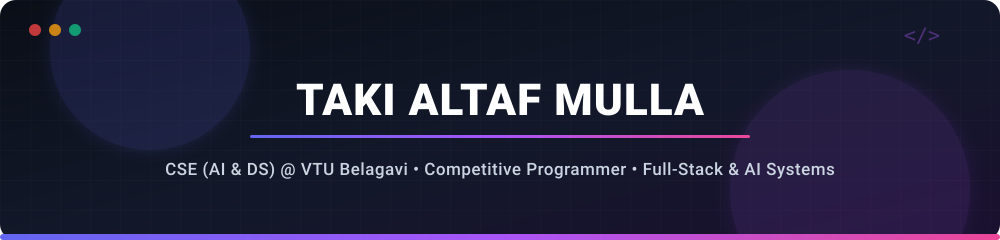

  

  

  
  
  

---

## About

I'm **Taki Altaf Mulla** (`LSTAKI`) — a **B.Tech (AI & Data Science)** student at **VTU Belagavi** focused on:

- **Competitive Programming & C++** (algorithms, data structures, performance optimization)
- **Full-Stack & AI Systems** (Next.js, Node.js, Firebase AI, Google GenKit orchestration)
- **Community Leadership & Hackathons** (GDGoC DevSprint Winner, Quantum Club VTU Lead)

---

## Featured Projects

<table>
  <tr>
    <td width="50%" valign="top">
      <h3><a href="https://github.com/LSTAKI/RescueBite">RescueBite</a> — Surplus Food Platform</h3>
      
<code>Node.js</code> • <code>Express</code> • <code>MongoDB</code> • <code>Mongoose</code> • <code>JWT</code> • <code>Zod</code>

      
Full-stack surplus food exchange platform connecting commercial food donors with verified NGOs to rescue fresh food and reduce landfill waste.

    </td>
    <td width="50%" valign="top">
      <h3><a href="https://github.com/LSTAKI/vtu-quantum-club">vtu-quantum-club</a> • <a href="https://vtu-quantum-club.vercel.app">Live Demo</a></h3>
      
<code>React</code> • <code>TypeScript</code> • <code>Three.js</code> • <code>Vite</code> • <code>Tailwind CSS</code>

      
Official interactive web portal for Quantum Club VTU featuring 3D graphics, event registration systems, and student developer resources.

    </td>
  </tr>
  <tr>
    <td width="50%" valign="top">
      <h3><a href="https://github.com/LSTAKI/classroom-control">classroom-control</a> — AI Center</h3>
      
<code>Next.js</code> • <code>Google GenKit AI</code> • <code>Firebase</code> • <code>React</code> • <code>Tailwind</code>

      
AI-powered classroom control center for teachers to digitize education, automate lesson planning, and streamline classroom management.

    </td>
    <td width="50%" valign="top">
      <h3><a href="https://github.com/LSTAKI/mediflow-triage">mediflow-triage</a> — Smart Triage</h3>
      
<code>Next.js</code> • <code>MongoDB</code> • <code>React</code> • <code>Tailwind CSS</code> • <code>Framer Motion</code>

      
Intelligent hospital patient triage system designed to streamline emergency room priority queues and medical workflow management.

    </td>
  </tr>
  <tr>
    <td width="50%" valign="top">
      <h3><a href="https://github.com/LSTAKI/chem-sim">chem-sim</a> — 2D Reaction Simulator</h3>
      
<code>React</code> • <code>TypeScript</code> • <code>Pixi.js</code> • <code>Vite</code>

      
Interactive 2D chemical reaction simulator rendering dynamic atomic and molecular interactions in real time via Pixi.js canvas engine.

    </td>
    <td width="50%" valign="top">
      <h3><a href="https://github.com/LSTAKI/firebase-ai-logic">firebase-ai-logic</a> — AI Layer</h3>
      
<code>React</code> • <code>TypeScript</code> • <code>Firebase</code> • <code>Tailwind CSS</code>

      
Client-side LLM integration layer demonstrating real-time AI logic paired with Firebase cloud backend services.

    </td>
  </tr>
</table>

---

## Tech Stack

<b>Languages</b> 
  
  
  
  
  
  

<b>Frontend &amp; Frameworks</b> 
  
  
  
  
  

<b>Backend &amp; Databases</b> 
  
  
  
  
  
  

<b>AI &amp; Developer Tools</b> 
  
  
  
  
  

---

## Achievements

- **GDGoC Summer DevSprint** — 🏆 **Public Voting Winner** &amp; ⭐ **Team MVP**  
  
- **NASA Space Apps Challenge (Belagavi)** — 📊 **Best Use of Data Award Winner**

---

## Leadership

- **Web Designing Lead** — Quantum Club VTU
- **Class Ambassador** — Google Developer Group (GDG) Belgaum

---

## Beyond the Code

I spend my time solving algorithmic challenges in C++, designing web portals for student developer communities, and building full-stack AI prototypes in hackathons.
I enjoy building software systems for the same reason I like competitive programming: both reward structured thinking, technical precision, and curiosity.

---

## GitHub Stats

  
  

